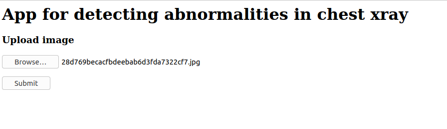
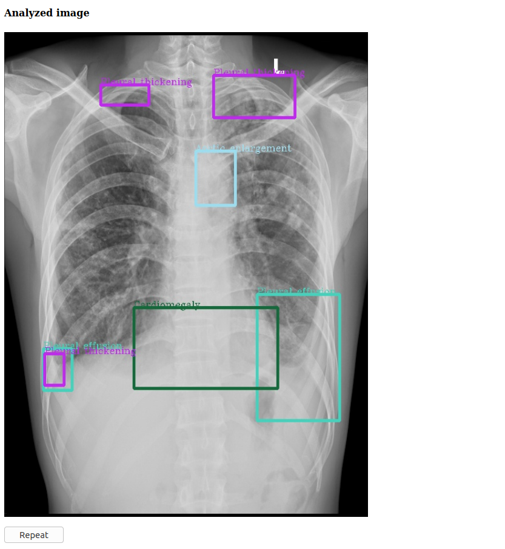

# Chest abnormalities detection

## Description
When you have a broken arm, radiologists help save the day—and the bone. These doctors diagnose and treat medical conditions using imaging techniques like CT and PET scans, MRIs, and, of course, X-rays. Yet, as it happens when working with such a wide variety of medical tools, radiologists face many daily challenges, perhaps the most difficult being the chest radiograph. The interpretation of chest X-rays can lead to medical misdiagnosis, even for the best practicing doctor. Computer-aided detection and diagnosis systems (CADe/CADx) would help reduce the pressure on doctors at metropolitan hospitals and improve diagnostic quality in rural areas.

Existing methods of interpreting chest X-ray images classify them into a list of findings. There is currently no specification of their locations on the image which sometimes leads to inexplicable results. A solution for localizing findings on chest X-ray images is needed for providing doctors with more meaningful diagnostic assistance.

## Analysis and modeling
We follow the next steps:
1. EDA (notebooks/EDA.ipynb)
3. Modeling : Yolo v5 (notebooks/Yolov5.ipynb)
4. Modeling : FasterRCNN (notebooks/FasterRCNN.ipynb)
5. Modeling : binary classifier - abnormal/normal image (notebooks/binary_classifier.ipynb)

## Datasets 

1. https://www.kaggle.com/awsaf49/vinbigdata-512-image-dataset

2. https://www.kaggle.com/raddar/vinbigdata-competition-jpg-data-2x-downsampled

3. https://www.kaggle.com/c/vinbigdata-chest-xray-abnormalities-detection/data

## Web app for abnormaly detection

Example of web app for abnormalities detection

Step 1. Uploading image

Step 2. Click submit and see the result

