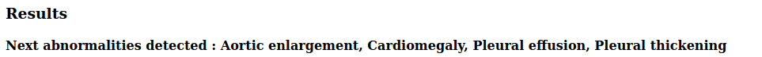
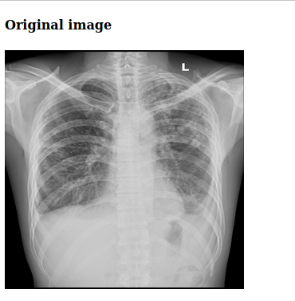

# Chest abnormalities detection

## Description
Detection of abnormalities on chest X-ray images.

We need to find several abnormalities on chest X-ray images.

Example of images

For solving this problem we will apply FasterRCNN, Yolo_v5 using PyTorch and PyTorch_Lightning libraries 

And additionally we will build binary classifier to classify image - normal/abnormal

As a result of our work we will build simple web app using Flask which is capable of taking image and detecting abnormalities on it.

## Installation yolo v5 run

For install Yolo v5 run following commands:

1. !git clone https://github.com/ultralytics/yolov5
2. !mv yolov5/* ./
3. !pip install -r requirements.txt

## Analysis and modeling
We follow the next steps:
1. EDA (notebooks/EDA.ipynb)
3. Modeling : Yolo v5 (notebooks/Yolov5.ipynb)
4. Modeling : FasterRCNN (notebooks/FasterRCNN.ipynb)
5. Modeling : binary classifier - abnormal/normal image (notebooks/binary_classifier.ipynb)

## Datasets 

1. https://www.kaggle.com/awsaf49/vinbigdata-512-image-dataset

2. https://www.kaggle.com/raddar/vinbigdata-competition-jpg-data-2x-downsampled

3. https://www.kaggle.com/c/vinbigdata-chest-xray-abnormalities-detection/data

## Web app for abnormaly detection

Example of web app for abnormalities detection

Step 1. Uploading image

Step 2. Click submit and see the result

